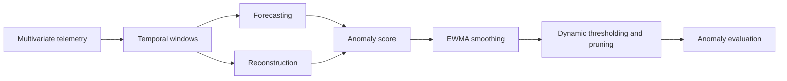

# Anomaly Detection in Spacecraft Telemetry

A **Geometric Learning project at Politecnico di Torino** investigating anomaly detection in multivariate time series from the NASA SMAP dataset.

The project compares six models, from classical baselines to recurrent neural networks, across two approaches: **forecasting future signal behavior** and **reconstructing observed behavior**. Model errors are converted into anomaly detections through a shared pipeline of smoothing and dynamic thresholding.

**Main notebook:** [Anomaly_Detection_V5.ipynb](Anomaly_Detection_V5.ipynb)

## Dataset

The notebook uses operational telemetry from the **SMAP (Soil Moisture Active Passive)** satellite, distributed with the [Telemanom project](https://github.com/khundman/telemanom#data). The dataset includes telemetry signals, command information, and annotated anomaly intervals.

The execution saved in the notebook covers **54 telemetry channels**, with **25 features per channel** and **68 evaluated anomalous sequences**. These counts describe the subset used in this project.

Each channel has two `.npy` files, one for training and one for testing, with shape `(timesteps, 25)`. Feature `0` is the primary signal being monitored; the remaining features provide operational context. The `labeled_anomalies.csv` file contains channel identifiers, spacecraft names, and anomaly intervals in the test set.

The notebook selects rows where `spacecraft == "SMAP"`. Data is used at its supplied scale, without additional standardization, and constant features are retained.

## Models

Each model is trained independently for each telemetry channel.

| Model | Approach | Main configuration |
| :--- | :--- | :--- |
| PCA | Linear reconstruction | Components explaining 95% of the variance |
| Random Forest Regressor | Forecasting | 100 trees operating on flattened windows |
| MLP Regressor | Forecasting | Hidden layers with 128 and 64 units; dropout 0.2 |
| MLP Autoencoder (AE) | Reconstruction | Dense encoder-decoder; 32-dimensional latent space |
| LSTM Regressor | Forecasting | Two LSTM layers with 80 units each; dropout 0.3 |
| LSTM Autoencoder | Reconstruction | Hidden size 64; 32-dimensional latent space |

## Pipeline



1. **Windowing:** 250-timestep windows with stride 1, using all 25 features.
2. **Modeling:** regressors predict the next 10 values of feature `0`; reconstruction models reconstruct the entire multivariate input window.
3. **Anomaly scoring:** absolute forecasting error with `first` aggregation, or mean squared reconstruction error over feature `0` across the input window.
4. **Post-processing:** EWMA smoothing, Telemanom-inspired dynamic thresholding, temporal buffering, pruning, and detection on inverted errors.
5. **Evaluation:** comparison with annotated intervals, per-channel analysis, and global summaries.

The shared post-processing configuration uses batches of 70, a history window of 30 batches, `smoothing_perc=0.05`, `error_buffer=100`, `p=0.13`, and `inverse=True`.

Neural networks use Adam, a learning rate of `1e-3`, MSE loss, a batch size of 64, and up to 35 epochs. The final 20% of training windows is reserved for validation, with early stopping and restoration of the best weights (`patience=10`, `min_delta=0.0003`).

## Results

The following values come from the **outputs already saved in the V5 notebook**, rounded to three decimal places. They were not generated by a new execution.

| Model | Precision | Recall | F1 | F0.5 | Macro AP | TP | FP | FN |
| :--- | ---: | ---: | ---: | ---: | ---: | ---: | ---: | ---: |
| PCA | 0.641 | 0.368 | 0.467 | 0.558 | 0.322 | 25 | 14 | 43 |
| Random Forest | 0.758 | 0.691 | 0.723 | 0.744 | 0.456 | 47 | 15 | 21 |
| MLP | 0.714 | 0.809 | 0.759 | 0.731 | 0.466 | 55 | 22 | 13 |
| MLP Autoencoder | 0.679 | 0.559 | 0.613 | 0.651 | 0.348 | 38 | 18 | 30 |
| **LSTM** | **0.781** | **0.838** | **0.809** | **0.792** | **0.534** | **57** | **16** | **11** |
| LSTM Autoencoder | 0.811 | 0.441 | 0.571 | 0.694 | 0.347 | 30 | 7 | 38 |

The **LSTM Regressor** achieves the highest F1 score and detects 57 of the 68 evaluated anomalous sequences. The MLP ranks second by F1. The LSTM Autoencoder achieves the highest precision but has lower recall, missing 38 anomalous sequences.

Forecasting models outperform reconstruction models in this comparison. This conclusion applies to the tested configurations and evaluation protocol.

### Interpreting the metrics

- **Precision, recall, F1, and F0.5** are computed from global event counts summed across channels. Detection is based on overlap between predicted and annotated intervals. In the implementation, each predicted interval is matched to the first overlapping ground-truth interval; true positives count distinct ground-truth intervals detected.
- **Macro AP** is the mean of per-channel point-wise Average Precision, computed with `average_precision_score`. It is named `pr_auc_macro` in the notebook and is not calculated using trapezoidal integration.
- Scores are aligned to raw test coordinates using an offset of 250. Evaluation uses the common length of predictions and labels; the first 250 scores are set to zero.

## Getting started

### 1. Set up the environment

The notebook metadata records **Python 3.11.15**. From the project directory, create a Python 3.11 environment and install the dependencies:

```bash
python3.11 -m venv .venv
source .venv/bin/activate
python -m pip install numpy pandas matplotlib scikit-learn torch jupyterlab ipykernel
python -m ipykernel install --user --name smap-anomaly --display-name "SMAP Anomaly Detection"
```

On Windows, activate the environment with `.venv\Scripts\activate` instead of `source .venv/bin/activate`.

Library versions are not pinned in an environment file. These commands install the required dependencies but do not reproduce the original experimental environment exactly.

### 2. Prepare the data

Follow the download instructions in the [Telemanom repository](https://github.com/khundman/telemanom#Getting-Started) and arrange the files as follows:

```text
.
├── README.md
├── Anomaly_Detection_V5.ipynb
├── Data_path/
│   ├── labeled_anomalies.csv
│   └── data/
│       └── data/
│           ├── train/
│           │   └── <chan_id>.npy
│           └── test/
│               └── <chan_id>.npy
└── Results/                       # CSV files generated during execution
```

Alternatively, update the three path variables near the beginning of the notebook:

```python
TRAIN_PATH = "Data_path/data/data/train"
TEST_PATH = "Data_path/data/data/test"
LABELS = "Data_path/labeled_anomalies.csv"
```

Paths are relative to the notebook's working directory. Both training and test files must be available for every SMAP channel listed in the CSV.

### 3. Run the notebook

```bash
jupyter lab Anomaly_Detection_V5.ipynb
```

Select the **SMAP Anomaly Detection** kernel and run the cells in order. A full execution repeats preprocessing, training, and evaluation for all six models across all channels.

The notebook runs on CPU or Apple MPS. The initial device selection also includes CUDA, but later cells before the MLP, AE, and LSTM sections overwrite CUDA with CPU when MPS is unavailable. To use an NVIDIA GPU, update these cells to follow the initial `if / elif / else` selection logic.

Windows for all channels are materialized in memory, so a full execution can require substantial RAM and training time.

## Outputs

The notebook produces plots of telemetry signals, anomaly scores, thresholds, detected intervals, and model comparisons. The `save_results` function writes:

```text
Results/<method>/<method>_channel_results_.csv
Results/<method>/<method>_global_summary_.csv
```

Method names are `Random_Forest`, `PCA`, `MLP`, `AE`, `LSTM`, and `LSTM-AE`. CSV files are overwritten whenever their corresponding saving cells are executed.

Trained models and predictions remain in in-memory dictionaries. The V5 notebook does not automatically save or load checkpoints. Final comparison plots are displayed in the notebook; to export them, set `save_dir` in the call to `plot_metric_comparisons`.

## Limitations and future work

Neural networks do not have a fixed global random seed, so results may vary between runs. Training and validation are also split after windowing: adjacent windows on either side of the split can share observations.

Forecasting and reconstruction share the post-processing pipeline but produce scores with different temporal meanings. Event-level metrics measure sequence detection and do not directly quantify detection delay.

Extensions proposed in the notebook include calibrating thresholds on a separate labeled validation set, using channel-specific thresholds, and designing scores that exploit the full prediction horizon. Test labels should remain reserved for final evaluation.
